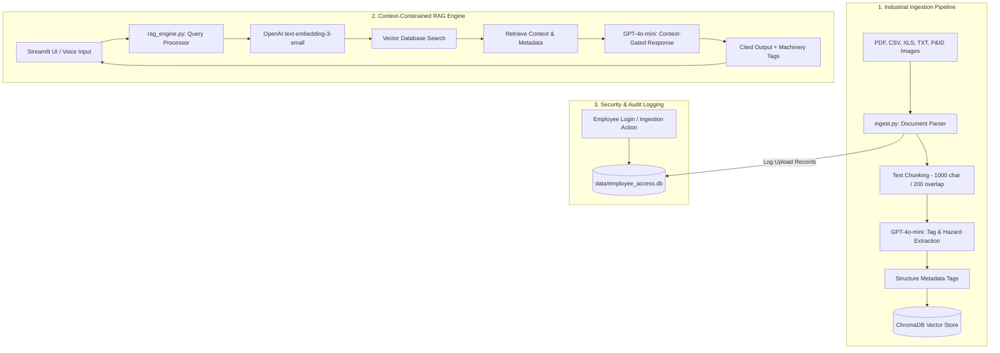

# 🏭 IKIP — Industrial Knowledge Intelligence Platform


> **IKIP** is an enterprise-grade Retrieval-Augmented Generation (RAG) platform purpose-built for industrial plants, refineries, and manufacturing facilities. It ingests Standard Operating Procedures (SOPs), maintenance logs, safety audits, and P&ID diagrams to build a searchable, compliance-aware, zero-hallucination industrial knowledge base.

---

## 📋 Table of Contents

- [Key Features](#-key-features)
- [System Architecture](#-system-architecture)
- [Directory Structure](#-directory-structure)
- [Tech Stack](#-tech-stack)
- [Getting Started & Setup](#-getting-started--setup)
  - [Prerequisites](#prerequisites)
  - [Installation](#installation)
  - [Configuration](#configuration)
  - [Generating Dummy Data](#generating-dummy-data)
  - [Running the Application](#running-the-application)
- [Database & Vector Metadata Schemas](#-database--vector-metadata-schemas)
  - [SQLite Audit Database](#sqlite-audit-database)
  - [ChromaDB Vector Metadata](#chromadb-vector-metadata)
- [Compliance & Safety Regulations](#-compliance--safety-regulations)
- [Interactive Frontend Consoles](#-interactive-frontend-consoles)
- [License & Credits](#-license--credits)

---

## ✨ Key Features

- 📄 **Multi-Format Industrial Ingestion**: Parse unstructured PDFs, Excel spreadsheets, CSV sensor logs, UTF-8 text documents, and P&ID schematics.
- 👁️ **Visual Diagram Understanding**: Uses OpenAI GPT-4o-mini Vision capabilities (`describe_image_with_vision`) to extract semantic text descriptions from complex process engineering diagrams.
- 🏷️ **Automated Entity & Hazard Extraction**: Automatically extracts machinery equipment tags (e.g., `P-101`, `V-303`), document categories, failure modes (e.g., *seal leakage*, *bearing friction*), and safety hazard warnings.
- 🔒 **Zero-Hallucination Strict RAG Engine**: Answers engineering queries strictly from cited context documents (`text-embedding-3-small` + `gpt-4o-mini`). Returns `"Information not found in current documents."` if out-of-scope.
- 🛠️ **Adaptive Maintenance Reporting**: Automatically formats outputs into structured industrial maintenance reports when maintenance-related queries are detected.
- 🎙️ **Voice-Activated Q&A**: Hands-free voice inquiry support powered by OpenAI Whisper (`whisper-1`) designed for field technicians and noise-heavy control rooms.
- 🔐 **Role-Based Audit & Security System**: SQLite user management featuring PBKDF2-HMAC-SHA256 salted password hashing, tracking employee login timestamps and document upload activities.
- 🛡️ **Compliance & Regulation Guard**: Real-time checking against industrial regulations including OISD, Indian Factories Act, and PESO guidelines.
- 🖥️ **Interactive Command Consoles**: Static HTML5/CSS3/JS dashboards featuring real-time sensor graphs, interactive equipment relationship networks, paginated document hubs, and manager consoles.

---

## 🏗️ System Architecture



---

## 📁 Directory Structure

```
AI-IKI-HACKTHON/
├── .chroma_db/                # ChromaDB vector database index and persistent storage
├── data/                      # Data storage directory
│   ├── employee_access.db     # SQLite DB tracking user accounts, logins, and upload logs
│   ├── Maintenance_Log.csv    # Generated synthetic maintenance log data
│   └── SOP_Pump_P-101.pdf     # Generated synthetic Standard Operating Procedure PDF
├── sample_documents/          # Source documents for demonstration and ingest testing
│   ├── pump_maintenance.txt   # Field technician service log for Pump P-101
│   └── safety_audit.txt       # Process Area 2 safety walkthrough log
├── app.py                     # Main Streamlit web application & control interface
├── ingest.py                  # Core document ingestion, parsing, vision & vector pipeline
├── rag_engine.py              # Embedding generation, vector retrieval & prompt runner
├── compliance_rules.json      # Configurable industrial compliance rules (OISD, PESO, SOPs)
├── generate_dummy_data.py     # Generator script for creating sample PDFs and CSV logs
├── index.html                 # Modern public landing page introducing IKIP features
├── dashboard.html             # Operational command dashboard with live sensor simulation
├── admin.html                 # Factory Manager control console for plant oversight
├── requirements.txt           # Python dependency requirements
├── project_brain.md           # Internal architecture reference & developer guide
└── .env                       # Local environment configuration (API Keys)
```

---

## 🛠️ Tech Stack

### Core RAG Backend & Engine
- **Language**: Python 3.9+
- **Application Framework**: [Streamlit](https://streamlit.io/)
- **LLM & Vision**: OpenAI GPT-4o-mini (Text extraction & structured JSON tagging, Vision diagram understanding)
- **Embeddings**: OpenAI `text-embedding-3-small` (1536 dimensions)
- **Voice Transcription**: OpenAI Whisper (`whisper-1`)
- **Vector Database**: [ChromaDB](https://www.trychroma.com/)
- **Relational Storage & Auth**: SQLite3 with salted PBKDF2 password hashing
- **File Parsing & Utilities**: `PyMuPDF` (fitz), `pypdf`, `pandas`, `openpyxl`, `Pillow`, `reportlab`, `python-dotenv`

### Web Consoles & User Interface
- **Frontend Core**: HTML5, Vanilla CSS3 (Custom Design System, Glassmorphism, Dark/Light Themes), JavaScript (ES6+)
- **Visualization Libraries**: [Chart.js](https://www.chartjs.org/) (sensor metrics & compliance ratings), [vis-network](https://visjs.github.io/vis-network/) (machinery topology graphs)
- **Icons & Typography**: [Lucide Icons](https://lucide.dev/), Google Fonts (*Inter*, *Outfit*, *JetBrains Mono*)

---

## 🚀 Getting Started & Setup

### Prerequisites
- **Python**: Version 3.9 or higher installed on your system.
- **OpenAI API Key**: Access to OpenAI API key with access to `gpt-4o-mini`, `text-embedding-3-small`, and `whisper-1`.

### Installation

1. **Clone the repository**:
   ```bash
   git clone https://github.com/Sahilpatil092006/AI-IKI-HACKTHON.git
   cd AI-IKI-HACKTHON
   ```

2. **Set up a virtual environment** *(recommended)*:
   - **Windows (PowerShell)**:
     ```powershell
     python -m venv venv
     .\venv\Scripts\Activate.ps1
     ```
   - **Linux / macOS**:
     ```bash
     python3 -m venv venv
     source venv/bin/activate
     ```

3. **Install dependencies**:
   ```bash
   pip install -r requirements.txt
   ```

### Configuration

Create a `.env` file in the root directory of the project:
```env
OPENAI_API_KEY=your_actual_openai_api_key_here
```

### Generating Dummy Data

Before running ingestion, generate the synthetic plant documents:
```bash
python generate_dummy_data.py
```
This script populates the `data/` folder with:
- `data/SOP_Pump_P-101.pdf` (Sample Standard Operating Procedure)
- `data/Maintenance_Log.csv` (Sample equipment maintenance log)

### Running the Application

1. **Launch the Streamlit App**:
   ```bash
   streamlit run app.py
   ```
2. **Access the Streamlit Dashboard**: Open your browser at `http://localhost:8501`.
3. **Register/Login**: Register an account (e.g., Employee ID `EMP-1001`) to access document ingestion and Q&A panels.
4. **Explore Frontend Mockups**: Open `index.html`, `dashboard.html`, or `admin.html` directly in any web browser to view the interactive management interfaces.

---

## 📊 Database & Vector Metadata Schemas

### SQLite Audit Database (`data/employee_access.db`)

The security module maintains three primary audit tables:

```sql
-- Employee User Registry
CREATE TABLE employees (
    employee_id TEXT PRIMARY KEY,
    employee_name TEXT NOT NULL,
    password_hash TEXT NOT NULL,       -- PBKDF2-HMAC-SHA256 salted hash
    created_at TEXT NOT NULL
);

-- Authentication Login Logs
CREATE TABLE login_records (
    id INTEGER PRIMARY KEY AUTOINCREMENT,
    employee_id TEXT NOT NULL,
    login_at TEXT NOT NULL,
    status TEXT NOT NULL               -- "success" or "failed"
);

-- Ingestion Operations Tracking
CREATE TABLE document_upload_records (
    id INTEGER PRIMARY KEY AUTOINCREMENT,
    employee_id TEXT NOT NULL,
    document_name TEXT NOT NULL,
    source_type TEXT NOT NULL,
    chunks_added INTEGER NOT NULL,
    uploaded_at TEXT NOT NULL
);
```

### ChromaDB Vector Metadata

Each text chunk ingested into the `industrial_docs` vector collection stores structured metadata:

| Metadata Field | Type | Description | Example Value |
| :--- | :--- | :--- | :--- |
| `document_name` | String | Original filename | `SOP_Pump_P-101.pdf` |
| `source_type` | String | Extension format | `pdf` |
| `source_hash` | String | SHA-1 unique content hash | `e2a47b16540c...` |
| `chunk_index` | Integer | Position of chunk in document | `0` |
| `uploaded_by` | String | ID of operator who uploaded document | `EMP-1001` |
| `equipment_tags`| String | Discovered equipment tags (`\|` separated) | `P-101\|M-101` |
| `entity_types` | String | Context classification (`\|` separated) | `maintenance\|safety` |
| `failure_modes` | String | Discovered equipment failure modes | `seal leakage` |
| `safety_hazards`| String | Safety warnings and risks identified | `rotating equipment` |
| `entities_json` | JSON Str | Complete raw structured JSON payload | `{"tags": ["P-101"], ...}` |

---

## 📜 Compliance & Safety Regulations

IKIP checks plant logs and queries against industrial compliance benchmarks defined in `compliance_rules.json`:

| Rule ID | Regulation Source | Rule Description | Trigger Keywords |
| :--- | :--- | :--- | :--- |
| **RULE-OISD-105** | OISD-STD-105 | Lock-Out Tag-Out (LOTO) isolation permit must be verified by a safety officer prior to pump casing opening. | `LOTO`, `isolation`, `permit` |
| **RULE-FAC-1948-21** | Factory Act Sec 21 | Machinery fencing requirement for dangerous moving parts and machinery. | `fenc`, `guard`, `barrier` |
| **RULE-PESO-HE-02** | PESO Guidelines | Mandatory hydrostatic pressure testing for all pressure vessels every 5 years. | `hydrostatic`, `pressure test`, `vessel` |
| **RULE-SOP-OP-12** | SOP-MAINT-12 | Daily thermal imaging scan on bearing housings of critical pumps (P-101) to check for overheating. | `thermal`, `bearing`, `P-101` |

---

## 🖥️ Interactive Frontend Consoles

In addition to the Streamlit core, IKIP features three dedicated HTML5 operational portals:

1. **Public Landing Page (`index.html`)**:
   - Clean, light-themed responsive overview of IKIP capabilities.
   - Interactive feature showcases, statistics counters, and system architecture summaries.

2. **Refinery Command Console (`dashboard.html`)**:
   - Dark-theme control room simulation featuring engineer shift profiles (`PR-01` to `PR-06`).
   - Paginated industrial document hub (4 documents per page).
   - Real-time simulated sensor gauges (temperature, pressure, vibration).
   - Interactive `vis-network` canvas mapping relations between equipment, safety rules, and engineers.

3. **Factory Manager Console (`admin.html`)**:
   - Dedicated administration panel for plant managers.
   - Live compliance violation alerts, user access audit trails, and system-wide ingestion stats.

---

## 🤝 License & Credits

Designed and developed by **Aaditya Joshi** and **Sahil Patil** for the **AI-IKI Hackathon**.  
Built with ❤️ using Python, Streamlit, ChromaDB, and OpenAI.

