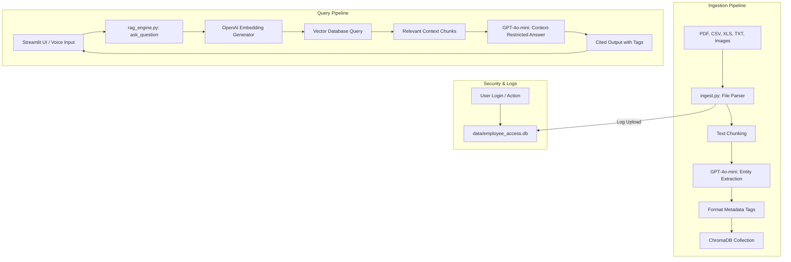

# IKIP — Industrial Knowledge Intelligence Platform
## Project Brain & Architecture Guide
**Designed and Developed by:** Aaditya Joshi & Sahil Patil

Welcome to the **IKIP** (Industrial Knowledge Intelligence Platform) project brain. This document contains a detailed overview of the system architecture, file structure, workflows, data models, and configurations of this project.


---

## 1. Project Overview

IKIP is a specialized Retrieval-Augmented Generation (RAG) platform tailored for industrial facilities (such as plants and refineries). It ingests standard operating procedures (SOPs), maintenance logs, safety audits, and diagrams (including P&IDs) to create a searchable, compliance-aware industrial knowledge base.

Key features include:
*   **Multi-Format Document Ingestion:** Supports PDFs, Excel spreadsheets, CSV logs, text files, and images (e.g., process diagrams) parsed via LLM Vision APIs.
*   **Entity & Metadata Enrichment:** Automatically extracts equipment tags (e.g., `P-101`), document types, failure modes, and safety hazards using GPT-4o-mini structured JSON outputs.
*   **Vector Search Database:** Stores chunks and metadata in a persistent ChromaDB instance.
*   **Context-Constrained RAG Engine:** Answers engineering queries strictly based on cited documents, with custom-tailored response formats for maintenance reports.
*   **Employee Operations Audit & Security:** Integrates SQLite-based authentication to track employee logins and document upload histories.
*   **Streamlit Web Interface:** Interactive portal with voice input transcription (OpenAI Whisper) and automatic metadata tag filtering.
*   **Concept Demonstrations:** High-fidelity interactive static mockups (`index.html` landing page and `dashboard.html` enterprise operations console with frontend security login gate).

---

## 2. Directory & File Inventory

```
AI-IKI-HACKTHON/
├── .chroma_db/                # ChromaDB vector database files
├── .dist/                     # Empty build distribution folder
├── data/                      # Data storage folder (SQLite DB and dummy assets)
│   ├── employee_access.db     # Created dynamically: stores login & upload logs
│   ├── Maintenance_Log.csv    # Generated dummy CSV log
│   └── SOP_Pump_P-101.pdf     # Generated dummy PDF document
├── sample_documents/          # Source documents used for testing ingestion
│   ├── pump_maintenance.txt   # Field technician log for pump P-101
│   └── safety_audit.txt       # Process Area 2 safety walkthrough log
├── app.py                     # Main Streamlit web application
├── ingest.py                  # Chunking, parsing, and vector ingestion module
├── rag_engine.py              # Embedding generation and LLM query runner
├── compliance_rules.json      # Predefined safety regulations & SOP keywords
├── generate_dummy_data.py     # Python script to generate the dummy assets
├── index.html                 # Premium public-facing HTML landing page
├── dashboard.html             # Enterprise dark-theme operations control dashboard
├── requirements.txt           # Python library dependencies
└── .env                       # Local environment configurations (OpenAI API key)
```

---

## 3. Architecture & Data Flow



---

## 4. Component Details

### 4.1 Ingestion Engine (`ingest.py`)
This module handles all input document processing:
1.  **File Parsing:**
    *   **PDFs:** Attempts extraction using `PyMuPDF` (fitz) or falls back to `pypdf`.
    *   **Tabular (Excel/CSV):** Standardizes rows into labeled lists (`key: value` pairs) using `pandas`.
    *   **Images (PNG, JPG, WebP):** Uses GPT-4o-mini vision model (`describe_image_with_vision`) to translate P&ID schematics and drawings into factual text.
    *   **Text/Logs:** Decoded directly with UTF-8 representation.
2.  **Chunking:** Splitting documents using standard character-level size (default: 1000 characters, overlap: 200) while removing excessive whitespaces.
3.  **Entity Extraction (`extract_entities_for_chunk`):**
    *   If OpenAI API is configured: Queries GPT-4o-mini using JSON-mode schema:
        ```json
        {
          "tags": ["P-101"],
          "type": ["maintenance", "safety"],
          "failure_modes": ["seal leakage"],
          "safety_hazards": ["rotating equipment"]
        }
        ```
    *   If offline: Applies regex heuristics to search for standard equipment codes (like `P-101`, `V-303`) and predefined keyword bags.
4.  **Vector Store Upload:** Computes SHA-1 hash for checking duplicates and performs `.upsert()` of chunks and metadata into the `industrial_docs` Chroma collection.

---

### 4.2 RAG Engine (`rag_engine.py`)
Handles retrieval and strict question-answering behavior:
*   **Models:** Utilizes `text-embedding-3-small` (1536-dimensional embeddings) and `gpt-4o-mini` for LLM tasks.
*   **Strict Context Boundary:** The system prompt instructs the AI model to reply **exactly**: `Information not found in current documents.` if the answer is not explicitly mentioned in the retrieved context. No assumptions or external knowledge are allowed.
*   **Adaptive Formatting:**
    *   *Standard Query:* Outputs **Direct Answer**, **Source Document Name**, and **Related Equipment Tags**.
    *   *Maintenance Query* (triggered when query contains *maintenance*, *inspection*, etc.): Formats the output with detailed sections:
        1. Maintenance Report Summary
        2. Inspection Engineer
        3. Maintenance Engineer
        4. Inspection and Maintenance Details
        5. Source Document Name
        6. Related Equipment Tags

---

### 4.3 Streamlit Web Application (`app.py`)
Provides the control room and interactive interface:
*   **Authentication Gate:** Checks credentials against the SQLite database. Supports employee login and new account registration.
*   **Ingestion Panel:** Allows folder path ingestion and multi-file drag-and-drop.
*   **Discovered Tags Sidebar:** Extracts and displays unique equipment tags, failure modes, and hazards present in the database. Clicking an equipment tag filters focus.
*   **Voice Q&A:** Captures audio input and transcribes it using OpenAI's `whisper-1` model before executing the RAG query.
*   **Audit Expansion UI:** Displays individual employee login records and document upload histories directly inside the sidebar.

---

### 4.4 SQLite Operations DB (`data/employee_access.db`)
Tracks activities to verify plant security and operations audits. The tables initialized in `initialize_access_db()` are:

```sql
-- Employee Directory
CREATE TABLE IF NOT EXISTS employees (
    employee_id TEXT PRIMARY KEY,
    employee_name TEXT NOT NULL,
    password_hash TEXT NOT NULL,       -- PBKDF2-HMAC-SHA256 salted hash
    created_at TEXT NOT NULL
);

-- Login Records Auditing
CREATE TABLE IF NOT EXISTS login_records (
    id INTEGER PRIMARY KEY AUTOINCREMENT,
    employee_id TEXT NOT NULL,
    login_at TEXT NOT NULL,
    status TEXT NOT NULL               -- "success" or "failed"
);

-- Ingestion Operations History
CREATE TABLE IF NOT EXISTS document_upload_records (
    id INTEGER PRIMARY KEY AUTOINCREMENT,
    employee_id TEXT NOT NULL,
    document_name TEXT NOT NULL,
    source_type TEXT NOT NULL,
    chunks_added INTEGER NOT NULL,
    uploaded_at TEXT NOT NULL
);
```

---

## 5. Metadata Schema in ChromaDB

Every ingested text chunk is indexed with the following metadata tags:

| Field Name | Type | Description | Example |
| :--- | :--- | :--- | :--- |
| `document_name` | String | Filename of the source document | `Maintenance_Log.csv` |
| `source_type` | String | Extension or file type parsed | `csv` |
| `source_hash` | String | SHA-1 unique hash of the file bytes | `e2a47b165...` |
| `chunk_index` | Integer | Index of the chunk within the document | `0` |
| `uploaded_by` | String | Employee ID of the parser | `EMP-4021` |
| `equipment_tags`| String | Discovered machinery tags (delimited by `\|`) | `P-101\|M-101` |
| `entity_types` | String | Broad context types (delimited by `\|`) | `maintenance\|safety` |
| `failure_modes` | String | Discovered failure logs (delimited by `\|`) | `seal leakage\|overheating`|
| `safety_hazards`| String | Documented safety warnings (delimited by `\|`)| `rotating equipment` |
| `entities_json` | JSON Str | Complete raw JSON containing entity arrays | `{"tags": ["P-101"], ...}` |

---

## 6. Predefined Compliance Rules (`compliance_rules.json`)
The application defines industrial rules checked by operators during walk-throughs:
1.  **RULE-OISD-105** (Regulation: `OISD-STD-105`): Lock-Out Tag-Out (LOTO) isolation permit must be verified by a certified safety officer prior to opening any pump casing. (Keywords: `LOTO`, `isolation`, `permit`).
2.  **RULE-FAC-1948-21** (Regulation: `Factory Act Section 21`): Machinery fencing requirement. All moving parts and dangerous equipment must be securely fenced. (Keywords: `fenc`, `guard`, `barrier`).
3.  **RULE-PESO-HE-02** (Regulation: `PESO Rules`): Hydrostatic pressure testing of all pressure vessels must be conducted every 5 years. (Keywords: `hydrostatic`, `pressure test`, `vessel`).
4.  **RULE-SOP-OP-12** (Regulation: `SOP-MAINT-12`): Daily thermal imaging scan requirement on bearing housings of P-101 and other critical process pumps to monitor overheating. (Keywords: `thermal`, `bearing`, `P-101`).

---

## 7. Frontend Demonstrations

*   **Public Portal (`index.html`):** A landing page promoting the capabilities of IKIP. Utilizes modern design parameters: Light mode backdrop with soft gradient meshes, responsive flex grids, stats counter animations, and premium Outfit typography.
*   **Operational Console (`dashboard.html`):** A simulation of a refinery command center. Features include:
    *   *Engineer Access Gate:* Blocks cockpit entry using a beautiful glassmorphic login screen overlay validating engineer IDs (e.g., `PR-01` to `PR-06` shift profiles) with dynamic sidebar logout control.
    *   *Paginated Document Hub:* Replaces infinite scrolling layout with page-based pagination controls (4 items per page) to manage documents in the refinery intelligence system.
    *   *Real-time Sensor Monitoring:* Temperature, pressure, vibration gages.
    *   *Audit Log & Compliance Indicators:* Shows warning statuses if rules (like overdue PESO tests) are tripped.
    *   *Document Ingestion Monitors:* Displays files, chunks, and visual pipelines.
    *   *Network Topology Graph:* Visualizes relationships between equipment tags, safety regulations, and engineers using a `vis-network` canvas.
    *   *Chart.js Metrics:* Plots performance charts, ingestion statistics, and compliance ratings.

---

## 8. Setup & Development Instructions

### 8.1 Dependencies
Ensure Python 3.9+ is installed, then run:
```bash
pip install -r requirements.txt
```

### 8.2 Environment Configuration
Create a `.env` file in the root directory:
```env
OPENAI_API_KEY=your-openai-api-key-here
```

### 8.3 Generating Dummy Data
Before testing, run the dummy data generator:
```bash
python generate_dummy_data.py
```
This writes the dummy SOP pdf and maintenance CSV log to the `data/` folder, ready for upload or ingestion.

### 8.4 Starting the Application
Launch the Streamlit web dashboard:
```bash
streamlit run app.py
```
To view the front-end concepts, open `index.html` or `dashboard.html` in any web browser.
